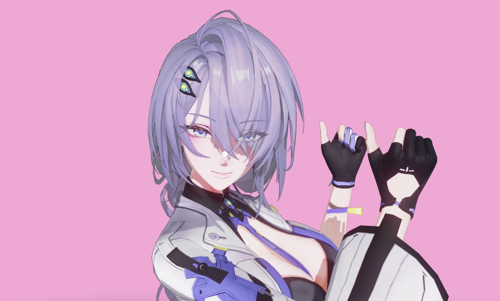

# Reze Engine

A minimal-dependency WebGPU engine for real-time MMD/PMX rendering. Only external dependency is Ammo.js for physics.



## Install

```bash
npm install reze-engine
```

## Features

- Blinn-Phong shading, alpha blending, rim lighting, outlines, MSAA 4x
- VMD animation with IK solver and Bullet physics
- Orbit camera with bone-follow mode
- GPU picking (double-click/tap)
- Ground plane with PCF shadow mapping
- Multi-model support

## Usage

```javascript
import { Engine, Vec3 } from "reze-engine";

const engine = new Engine(canvas, {
  ambientColor: new Vec3(0.88, 0.92, 0.99),
  cameraDistance: 31.5, // MMD units (1 unit = 8 cm)
  cameraTarget: new Vec3(0, 11.5, 0),
});
await engine.init();

const model = await engine.loadModel("hero", "/models/hero/hero.pmx");
await model.loadVmd("idle", "/animations/idle.vmd");
model.show("idle");
model.play();

engine.setCameraFollow(model, "センター", new Vec3(0, 3.5, 0));
engine.addGround({ width: 160, height: 160 });
engine.runRenderLoop();
```

## API

One WebGPU **Engine** per page (singleton after `init()`). Load models via URL **or** from a user-selected folder (see [Local folder uploads](#local-folder-uploads-browser)).

### Engine

```javascript
engine.init()
engine.loadModel(name, path)
engine.loadModel(name, { files, pmxFile? })  // folder upload — see below
engine.getModel(name)
engine.getModelNames()
engine.removeModel(name)

engine.setMaterialVisible(name, material, visible)
engine.toggleMaterialVisible(name, material)
engine.isMaterialVisible(name, material)

engine.setIKEnabled(enabled)
engine.setPhysicsEnabled(enabled)

engine.setCameraFollow(model, bone?, offset?)
engine.setCameraFollow(null)
engine.setCameraTarget(vec3)
engine.setCameraDistance(d)
engine.setCameraAlpha(a)
engine.setCameraBeta(b)

engine.addGround(options?)
engine.runRenderLoop(callback?)
engine.stopRenderLoop()
engine.getStats()
engine.dispose()
```

### Local folder uploads (browser)

Use a hidden `<input type="file" webkitdirectory multiple>` (or drag/drop) and pass the resulting `FileList` or `File[]` into the engine. Textures resolve relative to the chosen PMX file inside that tree.

**Important:** read `input.files` into a normal array **before** setting `input.value = ""`. The browser’s `FileList` is _live_ — clearing the input empties it.

1. **`parsePmxFolderInput(fileList)`** — returns a tagged result (`empty` | `not_directory` | `no_pmx` | `single` | `multiple`). For `single`, you already have `files` and `pmxFile`. For `multiple`, show a picker (dropdown) of `pmxRelativePaths`, then resolve with **`pmxFileAtRelativePath(files, path)`**.
2. **`engine.loadModel(name, { files, pmxFile })`** — `pmxFile` selects which `.pmx` when the folder contains several.

```javascript
import {
  Engine,
  parsePmxFolderInput,
  pmxFileAtRelativePath,
} from "reze-engine";

// In <input onChange>:
const picked = parsePmxFolderInput(e.target.files);
e.target.value = "";

if (picked.status === "single") {
  const model = await engine.loadModel("myModel", {
    files: picked.files,
    pmxFile: picked.pmxFile,
  });
}

if (picked.status === "multiple") {
  // Let the user choose `chosenPath` from picked.pmxRelativePaths, then:
  const pmxFile = pmxFileAtRelativePath(picked.files, chosenPath);
  const model = await engine.loadModel("myModel", {
    files: picked.files,
    pmxFile,
  });
}
```

VMD and other assets still load by URL when the path starts with `/` or `http(s):`; relative paths are resolved against the PMX directory inside the upload.

### Model

```javascript
await model.loadVmd(name, url)
model.loadClip(name, clip)
model.show(name)
model.play(name)
model.play(name, { priority: 8 }) // higher number = higher priority (0 default/lowest)
model.play(name, { loop: true }) // repeat until stop/pause or another play
model.pause()
model.stop()
model.seek(time)
model.getAnimationProgress()
model.getClip(name)
model.exportVmd(name)              // returns ArrayBuffer

model.rotateBones({ 首: quat, 頭: quat }, ms?)
model.moveBones({ センター: vec3 }, ms?)
model.setMorphWeight(name, weight, ms?)
model.resetAllBones()
model.resetAllMorphs()
model.getBoneWorldPosition(name)
```

#### Animation data

`AnimationClip` holds keyframes only: bone/morph tracks keyed by `frame`, and `frameCount` (last keyframe index). Time advances at fixed `FPS` (see package export `FPS`, default 30).

#### VMD Export

`model.exportVmd(name)` serialises a loaded clip back to the VMD binary format and returns an `ArrayBuffer`. Bone and morph names are Shift-JIS encoded for compatibility with standard MMD tools.

```javascript
const buffer = model.exportVmd("idle");
const blob = new Blob([buffer], { type: "application/octet-stream" });
const link = document.createElement("a");
link.href = URL.createObjectURL(blob);
link.download = "idle.vmd";
link.click();
```

#### Playback

Call `model.play(name, options?)` to start or switch motion. `loop: true` makes the playhead wrap at the end of the clip until you stop, pause, or call `play` with something else. `priority` chooses which request wins when several clips compete.

#### Progress

`getAnimationProgress()` reports `current` and `duration` in seconds, plus `playing`, `paused`, `looping`, and related fields.

### Engine Options

```javascript
{
  ambientColor: Vec3,
  directionalLightIntensity: number,
  minSpecularIntensity: number,
  rimLightIntensity: number,
  cameraDistance: number,
  cameraTarget: Vec3,
  cameraFov: number,
  onRaycast: (modelName, material, screenX, screenY) => void,
  shadowLightDirection: Vec3,
  physicsOptions: {
    constraintSolverKeywords: string[],
  },
}
```

`shadowLightDirection` — direction of the shadow-only light, independent of the visible directional light. Default `(0.12, -1, 0.16)` casts a near-top-down shadow with a slight offset so extended limbs still project visible shadows.

`constraintSolverKeywords` — joints whose name contains any keyword use the Bullet 2.75 constraint solver; all others keep the stable Ammo 2.82+ default. See [babylon-mmd: Fix Constraint Behavior](https://noname0310.github.io/babylon-mmd/docs/reference/runtime/apply-physics-to-mmd-models/#fix-constraint-behavior) for details.

## Projects Using This Engine

- **[Reze Studio](https://reze.studio)** - Web-native MMD animation editor
- **[MiKaPo](https://mikapo.vercel.app)** — Real-time motion capture for MMD
- **[Popo](https://popo.love)** — LLM-generated MMD poses
- **[MPL](https://mmd-mpl.vercel.app)** — Motion programming language for MMD
- **[Mixamo-MMD](https://mixamo-mmd.vercel.app)** — Retarget Mixamo FBX to VMD

## Tutorial

[How to Render an Anime Character with WebGPU](https://reze.one/tutorial)
